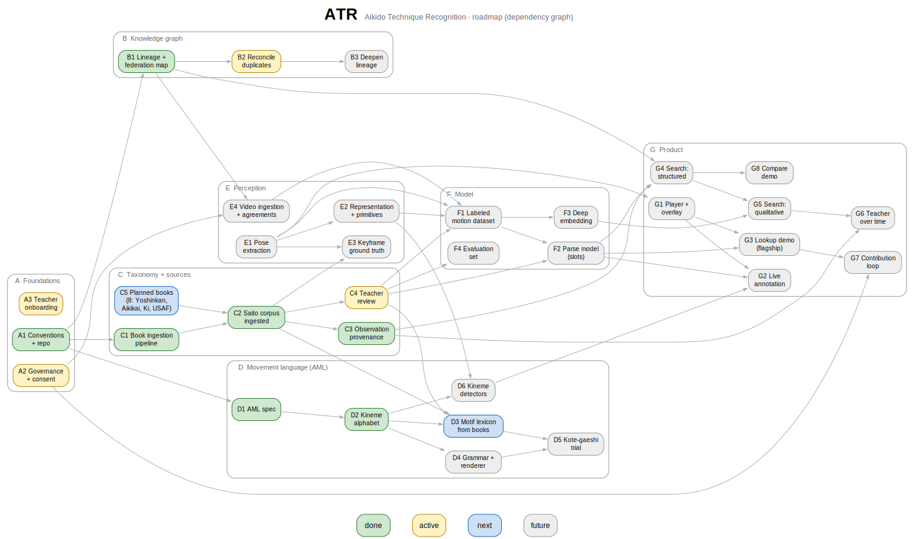

# Aikido Technique Recognition

Roadmap (dependency graph)

The original roadmap (atr_02) is a single staged line. The work has since grown into
parallel streams with real dependencies between them, so this is the same plan as a graph:
nodes are work items or assets, edges are "needs this first." Node ids carry the track (A
foundations, B knowledge graph, C taxonomy/sources, D movement language, E perception, F model,
G product). atr_02 stays as the narrative companion; this is the working map, and a draft.

Status: **done** (built and verified) · **active** (in progress / ongoing) · **next** (the
near-term front) · **future** (sequenced, not started).

---

## The graph

Source of truth: `atr_15_roadmap_graph.dot` (the graph) plus a status legend, composed into
`atr_15_roadmap_graph.svg` (legend below) by `atr_15_roadmap_build.py`. Regenerate on demand:
`python docs/atr_15_roadmap_build.py`. Nodes are color-coded by status (see the legend);
ids carry the track (A foundations ... G product).

---

## Tracks

- **A Foundations** -- conventions, repo, governance, onboarding. The base every stream rests on.
- **B Knowledge graph** -- who teaches whom, where, in which lineage. The substrate for
  teacher-scoped and lineage-scoped search. Built.
- **C Taxonomy + sources** -- what the techniques are, from printed matter; the observation model
  (who performed, when, from which recording). Corpus ingested; teacher ratification is next.
- **D Movement language (AML)** -- the symbolic layer between kinematics and the named technique.
  Spec and atomic alphabet done; motifs come from the books.
- **E Perception** -- turning video into a 3D skeleton and motion structure. Mostly unbuilt; the
  linchpin is pose extraction.
- **F Model** -- the parse (surface slots) and the deep continuous embedding (the research core).
- **G Product** -- the player, live annotation, the Lookup/Compare demos, search, and the
  contribution loop.

---

## Nodes

| ID | Node | Status | Needs first | Unblocks (key) |
|----|------|--------|-------------|----------------|
| A1 | Conventions + repo scaffold | done | -- | everything |
| A2 | Governance + consent (CARE/FAIR) | active | A1 | E4, G7 |
| A3 | Teacher onboarding | active | A1 | C4 (people to ratify) |
| B1 | Lineage + federation data map | done | A1 | E4, G4 (teacher scope) |
| B2 | Reconcile person duplicates | active | B1 | B3 |
| B3 | Deepen lineage (more feds, ratify) | future | B2 | richer scoping |
| C1 | Book ingestion pipeline | done | A1 | C2 |
| C2 | Saito corpus ingested | done | C1 | C3, C4, D3, E3 |
| C3 | Observation provenance | done | C2 | G4, G6 (time/teacher) |
| C4 | Teacher ratification of taxonomy | **next** | C2, A3 | D3, F1, F2, F4 |
| C5 | More sources + lineages | future | C1 | C2 (breadth) |
| D1 | AML spec | done | A1 | D2 |
| D2 | Kineme alphabet | done | D1 | D3, D4, D6 |
| D3 | Motif lexicon from books | **next** | D2, C2, C4 | D5 |
| D4 | Grammar / validation + renderer | future | D2 | D5 |
| D5 | Kote-gaeshi trial | future | D3, D4 | validates AML |
| D6 | Kineme detectors | future | D2, E2 | G2 |
| E1 | Pose extraction (video to skeleton) | future | A1 | E2, E3, F1, G1 -- the linchpin |
| E2 | Representation + motion primitives | future | E1 | D6, F1 |
| E3 | Keyframe pose/embedding ground truth | future | E1, C2 | matching, eval |
| E4 | Video ingestion + source agreements | future | B1, A2 | F1 |
| F1 | First labeled motion dataset | future | E1, E2, E4, C4 | F2, F3 |
| F2 | Parse model (surface slots) | future | F1, C4 | G2, G3, G4 |
| F3 | Deep embedding (the research core) | future | F1 | G5 |
| F4 | Evaluation set (teacher agreement) | future | C4 | trustworthy metrics |
| G1 | Skeleton player + video overlay | future | E1 | G2, G3 |
| G2 | Live annotation over video | future | G1, D6, F2 | the "categorize movement" capability |
| G3 | Technique Lookup demo (flagship) | future | F2, G1 | G7 |
| G4 | Search: structured similarity + teacher scope | future | F2, C3, B1 | G5, G8 |
| G5 | Search: qualitative similarity | future | F3, G4 | G6 |
| G6 | Teacher-over-time / stylistic drift | future | G5, C3 | preservation goal |
| G7 | Contribution loop | future | G3, A2 | the project's flywheel |
| G8 | Compare demo | future | G4 | cross-style study |

---

## Critical path and where we are

The whole **knowledge side is built**: the lineage data map (B1), the ingested corpus and its
observation provenance (C2, C3), and the AML spec + alphabet (D1, D2). Because B1 and C3 already
exist, the moment a parse model (F2) lands, **teacher-scoped and time-scoped structured search
(G4)** works -- those substrates are ahead of schedule.

The unbuilt critical path runs through **perception and the model**:

> **E1 pose extraction -> E2 representation -> F1 labeled dataset -> F2 parse model -> G3 Lookup + G2 annotation**, with **F1 -> F3 deep embedding -> G5 qualitative search -> G6 stylistic drift**.

Two linchpins stand out. **E1 (pose extraction)** is the single node that gates everything
video-side -- nothing in Perception, Model, or Product moves without it. **F3 (the deep
embedding)** is the project's stated research core: it is what turns "same slots" into "similar
movement," and what makes the teacher-over-time comparison meaningful.

Two near-term, low-dependency fronts that do not wait on perception: **C4 (teacher ratification
of the ingested taxonomy)** -- the first real contribution loop, on text -- and **D3 (motif
lexicon from the books)** for AML. Both build directly on work already done.

---

_ATR · roadmap dependency graph · rev 2026-06-15 · draft_
